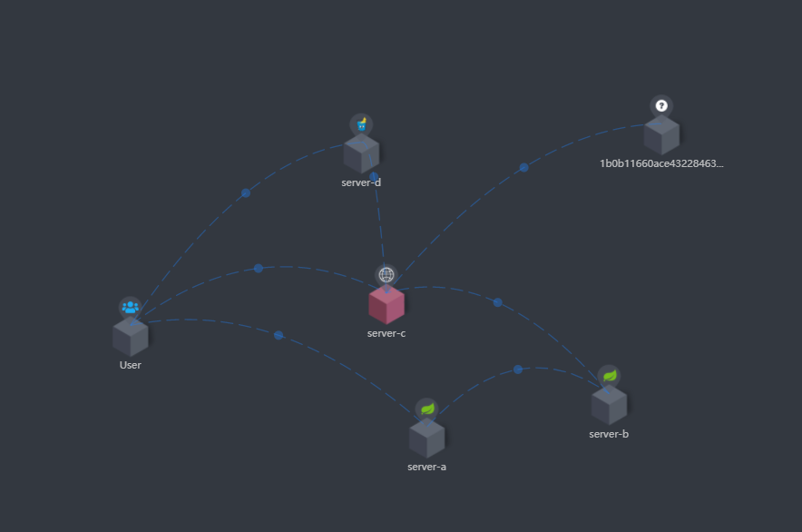
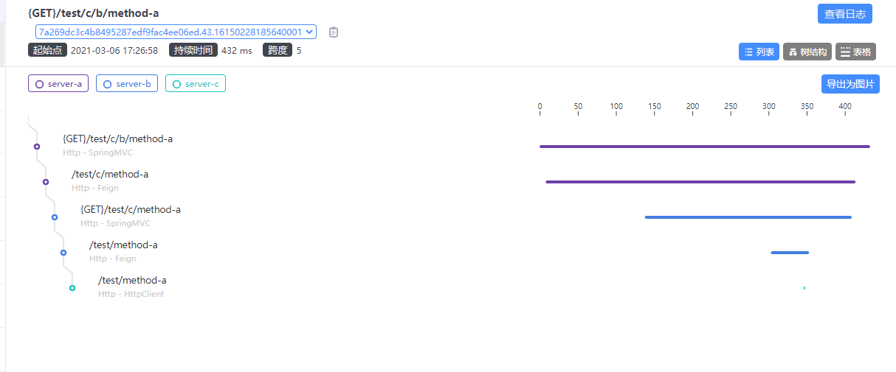
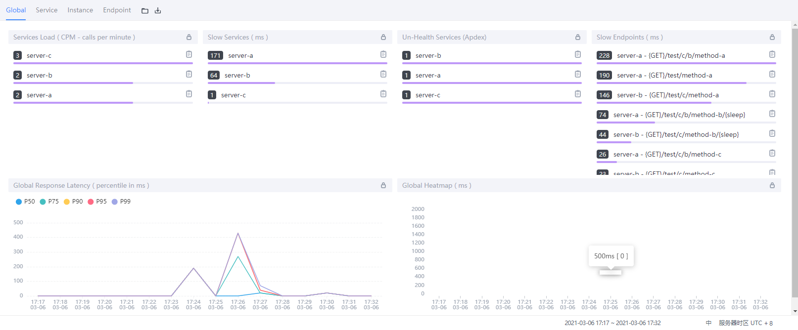

# skywalking-demo
Demo of skywalking

## 服务拓展图




```shell script
# 启动SkyWalking
$ cd skywalking-apm/bin
$ startup.bat
# APM面板 http://localhost:8080

# 编译服务 Service-A
$ cd server-a
$ mvn clean package
$ cd server-a\target
# 启动路径 service-a
java -javaagent:D:\mygithub\skywalking-demo\server-a\skywalking-agent\skywalking-agent.jar -jar server-a-0.0.1-SNAPSHOT.jar

# 编译服务 Service-B
$ cd server-b
$ mvn clean package
$ cd server-b\target
# 启动路径 service-a
java -javaagent:D:\mygithub\skywalking-demo\server-b\skywalking-agent\skywalking-agent.jar -jar server-b-0.0.1-SNAPSHOT.jar
```